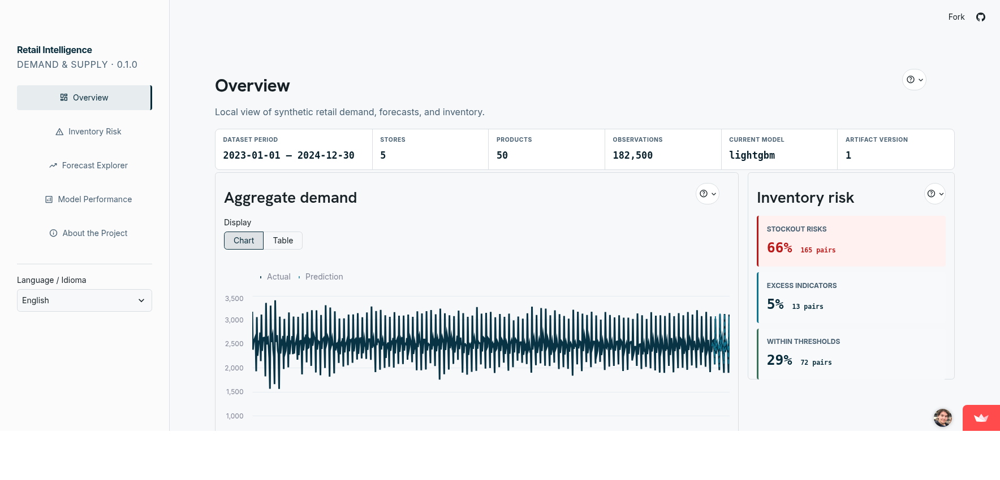
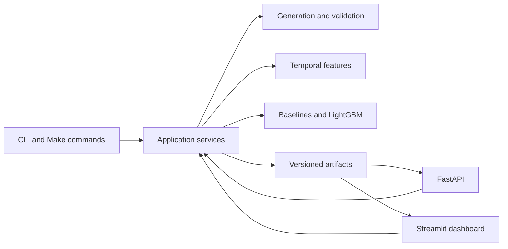
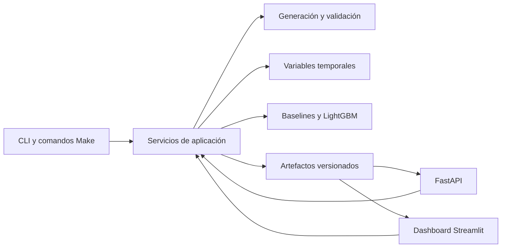

# Retail Demand Intelligence

[English](#english) · [Español](#español) · [Live demo](https://retail-demand-intelligence.streamlit.app/)



> The demo uses generated stores, products, sales, prices, promotions, and inventory. It contains no
> company or customer data. Streamlit may put the app to sleep after inactivity. If that happens, use
> the wake-up option on the page and allow a few minutes for it to start.

## English

Retail Demand Intelligence is a local-first forecasting project for exploring synthetic retail
demand, comparing models, and reviewing inventory risk through Streamlit and FastAPI.

### Contents

- [What it demonstrates](#what-it-demonstrates)
- [Data](#data)
- [Architecture](#architecture)
- [Technology](#technology)
- [Quick start](#quick-start)
- [Common workflows](#common-workflows)
- [Testing](#testing)
- [Repository structure](#repository-structure)
- [Limitations](#limitations)
- [Development approach](#development-approach)
- [Documentation](#documentation)
- [Contributing and license](#contributing-and-license)

### What it demonstrates

- Deterministic Parquet datasets with schemas, relationships, and business-rule validation.
- Recent-average, weekly seasonal-naive, and LightGBM forecasts.
- Chronological train, validation, and test periods with prediction-time-safe features.
- MAE, WAPE, and MASE overall and by store and product.
- Checksummed model, prediction, metric, metadata, and compact demo artifacts.
- A bilingual Streamlit dashboard that reads saved artifacts without retraining.
- A typed, read-only FastAPI interface with OpenAPI documentation.
- Explicit states for missing artifacts, invalid selections, and unavailable metrics.

### Data

Every record is generated locally from a fixed seed. The generator creates related stores, products,
sales, prices, promotions, inventory snapshots, and calendar data. Validation checks schemas,
referential integrity, date ranges, price rules, and inventory constraints before training starts.

The tracked dashboard bundle is intentionally small. Larger generated data and training artifacts are
ignored by Git and can be reproduced with the commands below.

### Architecture



FastAPI and Streamlit share read-only application services. The dashboard does not depend on the API
process and neither interface trains a model while serving a request.

### Technology

- Python 3.12, uv, Pandas, PyArrow, Pydantic, and LightGBM
- Streamlit and FastAPI
- Ruff, strict Pyright, pytest, pytest-cov, pre-commit, and pip-audit
- Docker, GitHub Actions, CodeQL, and Dependabot

### Quick start

Requires Python 3.12 or newer, [uv](https://docs.astral.sh/uv/), and GNU Make.

```bash
git clone https://github.com/SebastianGaray/retail-demand-intelligence.git
cd retail-demand-intelligence
make install
make app
```

Open `http://localhost:8501`. The dashboard uses the tracked synthetic bundle by default.

### Common workflows

```bash
make sample-data     # Generate and validate the demo datasets
make train           # Train baseline and LightGBM models
make evaluate        # Calculate holdout metrics
make predictions     # Save champion predictions
make demo-artifacts  # Rebuild the compact hosted-dashboard bundle
make api             # Start FastAPI locally
```

Generated data is written under `data/processed/demo`. Model runs are written under
`artifacts/runs/demo`. Open `http://127.0.0.1:8000/docs` after `make api` to inspect the API.

### Testing

```bash
make format-check
make lint
make typecheck
make coverage
make audit
make check
```

The test suite covers domain rules, generation, forecasting, artifact persistence, API responses, and
dashboard presentation. CI also builds the container and imports the installed package.

### Repository structure

```text
src/retail_demand/   Domain, data, modeling, application, API, and dashboard code
tests/               Unit and integration tests with small synthetic fixtures
docs/                Architecture, decisions, setup, deployment, and release notes
data/                Local generated datasets
artifacts/           Local model runs and the compact tracked demo bundle
sdd/                 Specification, implementation plan, and completed tasks
```

### Limitations

- Evaluation uses one validation block and one test block rather than rolling-origin backtesting.
- Forecasts are point estimates without uncertainty intervals.
- Inventory risk is an estimated coverage signal, not a replenishment recommendation.
- The generator simplifies holidays, replenishment, supplier constraints, and lost demand.
- Pickled model artifacts must only be loaded from trusted runs.
- Hosted availability depends on Streamlit Community Cloud and its sleep behavior.

### Development approach

Work is guided by [`sdd/spec.md`](sdd/spec.md), [`sdd/plan.md`](sdd/plan.md), and
[`sdd/tasks.md`](sdd/tasks.md). The documents connect requirements, implementation decisions, and
completed validation rather than treating the specification as separate paperwork.

| Stage | How it was used |
| --- | --- |
| Specification | Defined chronology, leakage boundaries, artifact contracts, bilingual behavior, and acceptance evidence. |
| AI assistance | Supported implementation exploration, code review, documentation, and test-case generation. |
| Human decisions | Set forecasting assumptions, product scope, model acceptance, limitations, and final approval. |
| Evidence | Ruff, Pyright, pytest, coverage, dependency audits, container checks, and CodeQL verified the result. |

AI output was treated as a proposal, not as evidence. The live dashboard includes an **Engineering
Process** page with a concrete example of how this worked for prediction-time-safe features.

### Documentation

- [Architecture overview](docs/architecture/overview.md)
- [Architecture decisions](docs/decisions/README.md)
- [English getting started guide](docs/en/getting-started.md)
- [Release readiness](docs/en/release-readiness.md)
- [Release notes](RELEASE_NOTES.md)

### Contributing and license

See [CONTRIBUTING.md](CONTRIBUTING.md) before opening a pull request. Report security issues through
[SECURITY.md](SECURITY.md). The project is available under the [MIT License](LICENSE).

---

## Español

Retail Demand Intelligence es un proyecto local de pronóstico que permite explorar demanda retail
sintética, comparar modelos y revisar riesgo de inventario mediante Streamlit y FastAPI.

### Contenidos

- [Qué demuestra](#qué-demuestra)
- [Datos](#datos)
- [Arquitectura](#arquitectura-1)
- [Tecnologías](#tecnologías)
- [Inicio rápido](#inicio-rápido)
- [Flujos habituales](#flujos-habituales)
- [Pruebas](#pruebas)
- [Estructura del repositorio](#estructura-del-repositorio)
- [Limitaciones](#limitaciones-1)
- [Forma de trabajo](#forma-de-trabajo)
- [Documentación](#documentación)
- [Contribución y licencia](#contribución-y-licencia)

### Qué demuestra

- Datasets Parquet deterministas con esquemas, relaciones y reglas de negocio validadas.
- Pronósticos de promedio reciente, naive estacional semanal y LightGBM.
- Períodos cronológicos de entrenamiento, validación y prueba sin usar información futura.
- Métricas MAE, WAPE y MASE a nivel general, por tienda y por producto.
- Artefactos versionados con checksums para modelos, predicciones, métricas y metadatos.
- Un dashboard bilingüe que consulta resultados guardados sin volver a entrenar.
- Una API FastAPI tipada y de solo lectura con documentación OpenAPI.
- Estados claros cuando faltan artefactos, una selección no es válida o una métrica no está disponible.

### Datos

Todos los registros se generan localmente a partir de una semilla fija. El generador crea tiendas,
productos, ventas, precios, promociones, inventario y calendario relacionados entre sí. Antes del
entrenamiento se validan los esquemas, las referencias, las fechas, los precios y el inventario.

El bundle incluido para el dashboard es pequeño a propósito. Los datasets y artefactos de entrenamiento
más grandes no se versionan y pueden reproducirse con los comandos de esta guía.

### Arquitectura



FastAPI y Streamlit comparten servicios de lectura. El dashboard no depende del proceso de la API y
ninguna interfaz entrena modelos mientras responde una solicitud.

### Tecnologías

- Python 3.12, uv, Pandas, PyArrow, Pydantic y LightGBM
- Streamlit y FastAPI
- Ruff, Pyright estricto, pytest, pytest-cov, pre-commit y pip-audit
- Docker, GitHub Actions, CodeQL y Dependabot

### Inicio rápido

Necesitas Python 3.12 o superior, [uv](https://docs.astral.sh/uv/) y GNU Make.

```bash
git clone https://github.com/SebastianGaray/retail-demand-intelligence.git
cd retail-demand-intelligence
make install
make app
```

Abre `http://localhost:8501`. Por defecto el dashboard utiliza el bundle sintético incluido.

### Flujos habituales

```bash
make sample-data
make train
make evaluate
make predictions
make demo-artifacts
make api
```

Los datos se escriben en `data/processed/demo` y las ejecuciones de modelos en
`artifacts/runs/demo`. Después de `make api`, abre `http://127.0.0.1:8000/docs` para revisar la API.

### Pruebas

```bash
make format-check
make lint
make typecheck
make coverage
make audit
make check
```

Las pruebas cubren reglas de dominio, generación, pronósticos, persistencia de artefactos, respuestas
de la API y presentación del dashboard. CI también construye el contenedor e importa el paquete.

### Estructura del repositorio

```text
src/retail_demand/   Dominio, datos, modelos, aplicación, API y dashboard
tests/               Pruebas unitarias y de integración con fixtures sintéticos
docs/                Arquitectura, decisiones, instalación, despliegue y releases
data/                Datasets generados localmente
artifacts/           Ejecuciones locales y bundle compacto para la demo
sdd/                 Especificación, plan de implementación y tareas terminadas
```

### Limitaciones

- La evaluación usa un bloque de validación y uno de prueba, no backtesting rolling-origin.
- Los pronósticos son puntuales y no incluyen intervalos de incertidumbre.
- El riesgo de inventario es una señal de cobertura, no una recomendación de reposición.
- La generación simplifica feriados, reposición, proveedores y demanda perdida.
- Los modelos serializados con pickle solo deben cargarse desde ejecuciones confiables.
- La disponibilidad pública depende del modo de suspensión de Streamlit Community Cloud.

### Forma de trabajo

El trabajo se guía mediante [`sdd/spec.md`](sdd/spec.md), [`sdd/plan.md`](sdd/plan.md) y
[`sdd/tasks.md`](sdd/tasks.md). Los documentos conectan requisitos, decisiones de implementación y
validaciones terminadas, en lugar de tratar la especificación como documentación aislada.

| Etapa | Cómo se utilizó |
| --- | --- |
| Especificación | Definió cronología, límites contra leakage, contratos, comportamiento bilingüe y evidencia de aceptación. |
| Asistencia de IA | Apoyó la exploración, revisión de código, documentación y generación de casos de prueba. |
| Decisiones humanas | Definieron supuestos, alcance, aceptación de modelos, limitaciones y aprobación final. |
| Evidencia | Ruff, Pyright, pytest, cobertura, auditorías, contenedor y CodeQL verificaron el resultado. |

La salida de IA se trató como una propuesta, no como evidencia. El dashboard incluye una página
**Proceso de Ingeniería** con un ejemplo concreto aplicado a variables seguras al momento de predecir.

### Documentación

- [Resumen de arquitectura](docs/architecture/overview.md)
- [Decisiones de arquitectura](docs/decisions/README.md)
- [Guía de inicio en español](docs/es/getting-started.md)
- [Notas de versión](RELEASE_NOTES.md)

### Contribución y licencia

Revisa [CONTRIBUTING.md](CONTRIBUTING.md) antes de abrir un pull request. Los problemas de seguridad
se reportan mediante [SECURITY.md](SECURITY.md). El proyecto usa la [licencia MIT](LICENSE).
