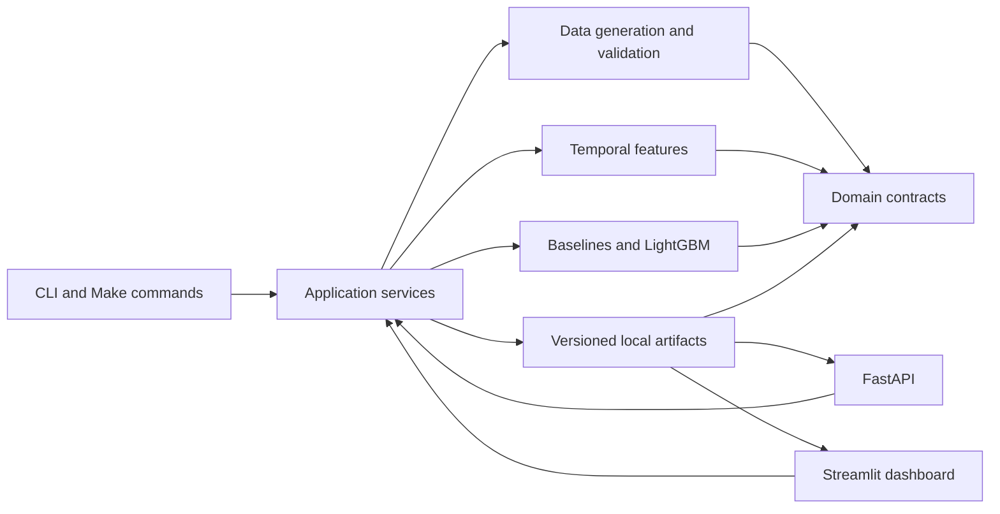

# Retail Demand Intelligence

Retail Demand Intelligence is a local Python project for generating synthetic retail data,
comparing demand forecasts, and inspecting inventory risk through FastAPI and Streamlit.

> **Synthetic data:** the included generator creates all stores, products, sales, prices,
> promotions, and inventory. No real company data is included.

> **Dashboard screenshot:** placeholder for the first published dashboard image.

**Live demo:** not published yet.

## Features

- Deterministic, related Parquet datasets with schema and business-rule validation.
- Recent-average, weekly seasonal-naive, and LightGBM forecasts.
- Chronological train, validation, and test periods with prediction-time-safe features.
- MAE, WAPE, and MASE overall, by store, and by product.
- Checksummed model, prediction, metric, and metadata artifacts.
- Bilingual Streamlit dashboard that reads saved artifacts directly.
- Typed local FastAPI endpoints with OpenAPI documentation.
- Ruff, Pyright, pytest, pre-commit, GitHub Actions, and Docker configuration.

## Architecture



FastAPI and Streamlit use the same read-only application service. The dashboard does not require
the API process. See the [architecture overview](docs/architecture/overview.md) and
[architecture decisions](docs/decisions/README.md).

## Quick start

Requires Python 3.12 or later, [`uv`](https://docs.astral.sh/uv/), and `make`.

```bash
git clone https://github.com/SebastianGaray/retail-demand-intelligence.git
cd retail-demand-intelligence
make install
make sample-data
make train
make evaluate
make predictions
make app
```

Open `http://localhost:8501`. `make demo` runs the data, training, evaluation, prediction, and
dashboard steps in one command.

## Workflows

Generate the deterministic demo datasets:

```bash
make sample-data
```

The command writes seven validated Parquet files and a manifest to `data/processed/demo`.

Train, evaluate, and save champion holdout predictions:

```bash
make train
make evaluate
make predictions
```

Artifacts are written to `artifacts/runs/demo`. Generated data and artifacts are ignored by Git.

Start the dashboard after preparing artifacts:

```bash
make app
```

The dashboard still starts when artifacts are missing and explains how to prepare them.

Start the local API:

```bash
make api
```

Open `http://127.0.0.1:8000/docs` for the OpenAPI interface.

## Validation

```bash
make format-check
make lint
make typecheck
make test
make check
```

`make check` runs formatting validation, linting, strict type checking, and all tests.

## Project structure

```text
src/retail_demand/
├── api/             # FastAPI routes and schemas
├── application/     # Workflow orchestration and saved-result queries
├── artifacts/       # Artifact metadata, checksums, and persistence
├── configuration/   # Environment-backed settings
├── dashboard/       # Streamlit application and translations
├── data/            # Contracts, validation, loading, and generation
├── domain/          # Framework-independent retail models and errors
├── features/        # Leakage-safe temporal features
└── modeling/        # Baselines, LightGBM, and evaluation
tests/               # Unit, integration, and small synthetic fixtures
docs/                # Architecture, ADRs, and user documentation
data/                # Ignored local datasets
scripts/             # Guidance for future command wrappers
```

## Metrics

- **MAE** is the average absolute error in units.
- **WAPE** is total absolute error divided by total observed demand.
- **MASE** scales MAE by the training period's weekly seasonal-naive error.

WAPE is unavailable when total demand is zero. MASE is unavailable when its training scale is
zero. The workflow reports metrics overall and by store and product without embedding benchmark
figures in the repository.

## Limitations

- Evaluation uses one validation block and one test block, not rolling-origin backtesting.
- Forecasts are point estimates and do not include uncertainty intervals.
- Inventory risk is based on estimated coverage, not a replenishment recommendation.
- Demo behavior simplifies holidays, replenishment, supplier constraints, and lost demand.
- Model artifacts use pickle and must only be loaded from trusted runs.
- A hosted dashboard needs a separately prepared synthetic artifact bundle.

## Roadmap

- Add rolling-origin evaluation.
- Add prediction intervals and forecast calibration.
- Add replenishment and lead-time scenarios.
- Publish a validated synthetic artifact bundle and live dashboard.

## Documentation

- [English documentation](docs/en/getting-started.md)
- [Documentación en español](docs/es/getting-started.md)
- [Streamlit Community Cloud deployment](docs/en/streamlit-community-cloud.md)
- [Release readiness](docs/en/release-readiness.md)
- [Release notes](RELEASE_NOTES.md)

## Contributing and license

See [CONTRIBUTING.md](CONTRIBUTING.md) before opening a pull request. Security issues should
follow [SECURITY.md](SECURITY.md).

Licensed under the [MIT License](LICENSE).
