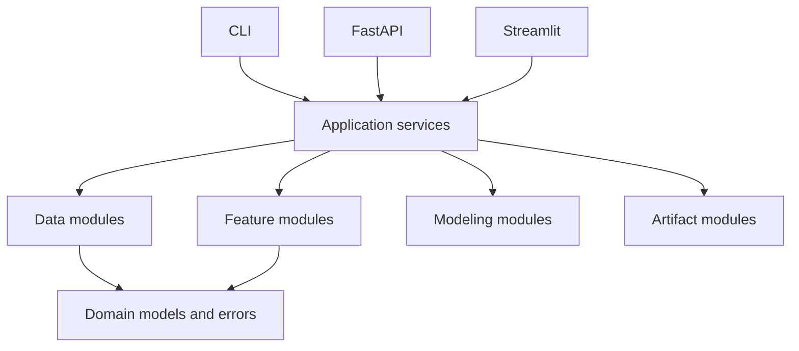

# Architecture

Retail Demand Intelligence generates and validates synthetic retail data, builds temporal
features, compares forecasting models, saves evaluated artifacts, and exposes results through
local FastAPI and Streamlit interfaces.

## Source layout

```text
src/retail_demand/
├── configuration/   # Pydantic Settings
├── domain/          # Retail records and validation errors
├── application/     # Data generation, training, and saved-result queries
├── data/            # Parquet loading, contracts, validation, and generation
├── features/        # Temporal feature generation
├── modeling/        # Baselines, LightGBM, and metrics
├── artifacts/       # Metadata, checksums, and model persistence
├── api/             # FastAPI routes and response schemas
├── dashboard/       # Streamlit pages and translations
└── cli.py           # Local workflow commands
```

## Dependency direction



Domain modules do not import pandas, FastAPI, or Streamlit. Application services coordinate
concrete modules. FastAPI and Streamlit translate saved results for their delivery formats.

## Data flow

```mermaid
flowchart LR
    CONFIG["Seed and generation parameters"] --> GENERATE["Generate synthetic records"]
    GENERATE --> VALIDATE["Validate schemas and business rules"]
    VALIDATE --> PARQUET["Seven Parquet datasets and manifest"]
    PARQUET --> FEATURES["Horizon-shifted temporal features"]
    FEATURES --> SPLIT["Chronological train, validation, and test blocks"]
    SPLIT --> BASELINES["Recent-average and seasonal-naive models"]
    SPLIT --> LGBM["LightGBM"]
    BASELINES --> SELECT["Validation WAPE selection"]
    LGBM --> SELECT
    SELECT --> EVALUATE["Test metrics and predictions"]
    EVALUATE --> RUN["Checksummed artifact run"]
    RUN --> API["Local API"]
    RUN --> UI["Bilingual dashboard"]
```



## Boundaries

| Module | Responsibility |
|---|---|
| `configuration` | Read typed `RETAIL_DEMAND_` environment values and optional `.env` values. |
| `domain` | Define framework-independent retail records and structured data errors. |
| `application` | Run generation, training, evaluation, prediction export, and result queries. |
| `data` | Load Parquet, enforce contracts and relationships, and generate synthetic records. |
| `features` | Join validated datasets and create prediction-time-safe features. |
| `modeling` | Produce baseline and LightGBM predictions and calculate metrics. |
| `artifacts` | Persist metadata, model files, checksums, metrics, and predictions. |
| `api` | Validate HTTP inputs and return typed saved results or clear errors. |
| `dashboard` | Read saved results directly and render English or Spanish content. |

Pydantic validates settings, domain input records, artifact metadata, and API schemas. pandas is
used inside data, feature, modeling, artifact-query, and presentation boundaries.

## Forecast safeguards

The last configured horizon is the test block and the preceding horizon is validation. Earlier
eligible rows are training data. Dates are never shuffled.

Demand lags, rolling averages, inventory, and inbound quantities are shifted by the full horizon.
Calendar values, listed prices, and scheduled promotions are treated as known inputs. The
categorical encoder is fitted on training for validation and refitted on training plus validation
for the test block.

Validation WAPE selects the champion. LightGBM must improve on the best baseline by at least 2%.
otherwise a baseline remains champion.

## Artifacts

Each local run contains:

```text
metadata.json
model.pkl
validation_predictions.parquet
evaluation_predictions.parquet
metrics.json
predictions.parquet
```

Metadata records schema and feature versions, configuration, data periods, model parameters,
metrics, the source manifest checksum, and file checksums. Readers reject missing or changed
files. Model files use pickle and must only be loaded from trusted runs.

The dashboard and API use the same `ResultReader`. The dashboard does not call FastAPI, and
neither interface trains models at startup.

## Error handling

Dataset errors identify the dataset, row, field, and problem. CLI failures exit nonzero. FastAPI
maps missing artifacts to HTTP 503, unknown selections to HTTP 404, and invalid thresholds to
HTTP 422. Streamlit shows setup instructions when artifacts are unavailable.

## Testing

- Unit tests cover contracts, business rules, generation, temporal leakage boundaries, metrics,
  inventory-risk presentation logic, and translations.
- Integration tests cover Parquet generation, the training artifact pipeline, and FastAPI
  results and errors.
- The dashboard has a documented manual smoke test for interactive behavior.

`make check` runs Ruff formatting validation, Ruff linting, strict Pyright checks, and pytest.
