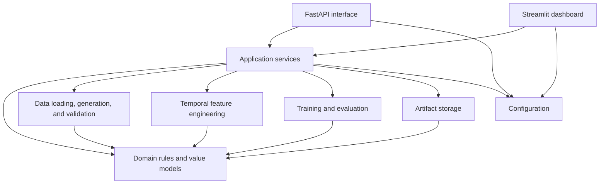
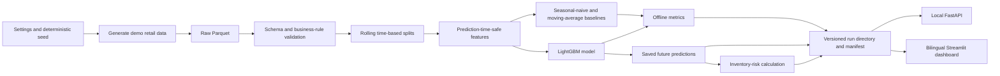

# MVP architecture

## Scope

The MVP generates deterministic retail data, validates it, builds temporal features, trains
baselines and LightGBM, evaluates forecasts offline, calculates inventory risk, and saves
versioned artifacts. FastAPI and Streamlit read those artifacts locally. The dashboard does not
depend on the API process.

## Proposed source tree

```text
src/retail_demand/
├── configuration/
│   └── settings.py
├── domain/
│   ├── errors.py
│   ├── inventory.py
│   └── models.py
├── application/
│   ├── generate_demo.py
│   ├── train.py
│   └── read_results.py
├── data/
│   ├── generation.py
│   ├── loading.py
│   ├── schemas.py
│   └── validation.py
├── features/
│   └── temporal.py
├── modeling/
│   ├── baselines.py
│   ├── evaluation.py
│   └── lightgbm.py
├── artifacts/
│   ├── metadata.py
│   └── store.py
├── api/
│   ├── main.py
│   └── schemas.py
└── dashboard/
    ├── app.py
    └── translations.py
```

Only add these files when their behavior is implemented. Workflow entry points belong in
`scripts/`; notebooks may explore data but cannot be imported by `src/retail_demand/`.

## Dependency direction



`domain` has no framework or storage dependencies. `application` coordinates concrete modules
without importing FastAPI or Streamlit. Delivery modules call application services and translate
domain errors into HTTP responses or user messages.

## Module responsibilities and interfaces

| Boundary | Responsibility | Initial interface |
|---|---|---|
| Configuration | Read environment-backed paths, seed, horizon, cutoff, and log level. | `get_settings() -> Settings` |
| Domain | Define validated retail records, forecast rows, metrics, and inventory-risk rules. | Pydantic models and pure functions |
| Application | Run complete use cases and enforce their order. | `generate_demo_data()`, `train_and_evaluate()`, `load_results()` |
| Data generation | Produce repeatable daily sales, price, promotion, stock, and inbound supply. | `generate_demo(config) -> DataFrame` |
| Data loading | Read CSV or Parquet without applying business behavior. | `load_retail_data(path) -> DataFrame` |
| Data validation | Check columns, types, uniqueness, ranges, dates, and business invariants. | `validate_retail_data(frame) -> None` |
| Features | Build calendar, price, promotion, lag, and rolling features for an explicit origin. | `build_features(frame, as_of, horizon) -> DataFrame` |
| Modeling | Fit seasonal-naive, moving-average, and LightGBM estimators behind one prediction shape. | `fit_*()` and `predict_*()` functions |
| Evaluation | Run rolling-origin splits and calculate MAE, WAPE, and bias by model and segment. | `evaluate(frame, origins, horizon) -> DataFrame` |
| Inventory | Compare forecast demand with on-hand and planned inbound supply. | `calculate_inventory_risk(...) -> DataFrame` |
| Artifacts | Write and verify one immutable run directory and its manifest. | `save_run(bundle) -> RunMetadata`, `load_run(run_id)` |
| API | Validate requests and return saved forecasts, metrics, and risks. | FastAPI routes calling `load_results()` |
| Dashboard | Read saved runs, select language, and render comparisons and risks. | Streamlit app calling `load_results()` |

DataFrames are the internal tabular boundary. Pydantic validates configuration, API payloads, and
artifact metadata; PyArrow schemas validate persisted tables. This avoids wrapper classes that do
not add current behavior.

## End-to-end flow



## Configuration

Pydantic Settings reads `RETAIL_DEMAND_` variables and optional `.env` values. Initial settings
cover input and artifact paths, random seed, forecast horizon, evaluation origins, locale, and log
level. Function arguments override settings inside tests. Secrets are not needed for local demo
workflows and must not appear in `.env.example`.

## Forecasting safeguards

Every evaluation fold has an explicit forecast origin. Training rows end before that origin.
Target lags and rolling statistics use shifted demand only. Calendar fields and planned
price/promotion values may extend into the horizon because they are known inputs; observed future
sales, stock outcomes, and revised plans may not.

Start with seasonal-naive and moving-average baselines. Add LightGBM only after those tests and
metrics pass. Compare every model on identical origins and horizons. Reject duplicate
`store_id`, `sku_id`, `date` keys, negative demand or stock, missing horizon dates, and invalid
cutoff ranges before training.

## Errors and logging

Use a small domain exception hierarchy: `RetailDemandError`, `DataValidationError`,
`ArtifactError`, and `ModelingError`. Raise errors where context is known; application services
add workflow context. CLI commands exit non-zero, FastAPI maps expected errors to 4xx responses,
and Streamlit shows a short user message while logging technical detail.

Use the standard `logging` module. Log workflow start and completion, row counts, date ranges,
forecast origin, model name, run ID, elapsed time, and artifact paths. Never log full datasets,
credentials, or per-row output.

## Artifacts and versioning

Each run is immutable:

```text
artifacts/runs/<run_id>/
├── manifest.json
├── model.joblib
├── predictions.parquet
├── inventory_risk.parquet
└── metrics.json
```

The run ID combines UTC time with a short configuration hash. `manifest.json` stores
`schema_version`, package version, creation time, seed, cutoff, horizon, input fingerprint,
feature version, model name and parameters, evaluation origins and metrics, relative file names,
and SHA-256 checksums. `artifacts/latest.json` contains only the selected run ID. Readers reject
unsupported schema versions or checksum mismatches.

## Testing strategy

- Domain and features: unit tests for invariants, lag boundaries, horizons, and inventory math.
- Data: schema tests using tiny deterministic fixtures and malformed examples.
- Modeling: fixed-seed tests proving baselines, chronological folds, metric calculations, and
  stable prediction shape; avoid asserting exact LightGBM floats.
- Artifacts: integration tests that round-trip a complete run in a temporary directory and detect
  corrupt metadata.
- API: FastAPI `TestClient` tests for saved-result routes and expected errors.
- Dashboard: unit-test translations and result shaping; keep visual smoke checks small.
- Workflow: one integration test from demo generation through saved predictions.

## Local and dashboard execution

The local sequence is `make sync`, generate demo data, train/evaluate, then start either interface.
Training is an explicit offline command, never startup work for FastAPI or Streamlit. Both
interfaces use the configured artifact directory and selected run ID.

For dashboard deployment, generate and validate a run first, copy that immutable run directory
with the dashboard deployment, and set its artifact path and default locale. The API is not
deployed with the dashboard. Regenerate artifacts when code, schemas, or model configuration
changes.

## Implementation plan

1. Define domain records, errors, settings, and data schemas with focused unit tests.
2. Add deterministic demo generation and Parquet round-trip validation.
3. Add leakage-safe temporal features and boundary tests.
4. Implement seasonal-naive and moving-average baselines with rolling evaluation.
5. Add artifact manifests, checksums, and round-trip integration tests.
6. Add LightGBM and compare it with the established baselines.
7. Calculate and persist inventory-risk outputs.
8. Add read-only application services and FastAPI routes for saved runs.
9. Add the bilingual Streamlit dashboard reading the same artifacts directly.
10. Add one end-to-end workflow test and document exact local commands.
